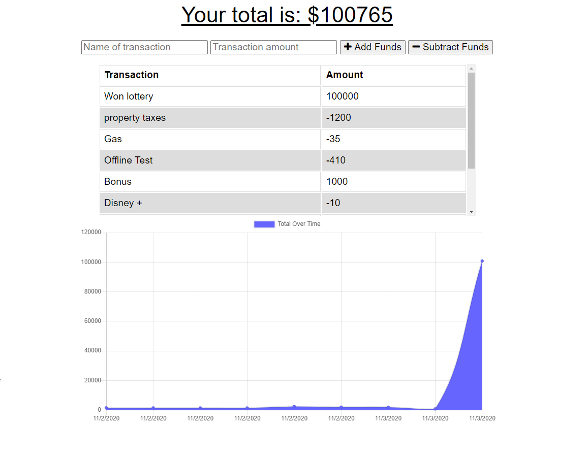
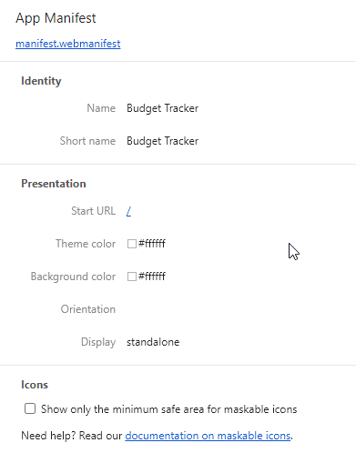
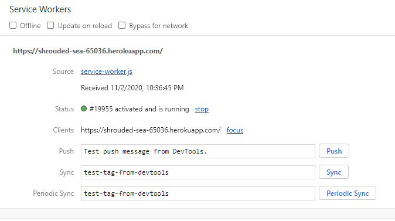
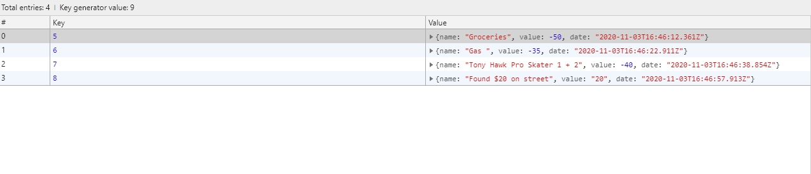

# Budget Tracker

## Description  
This is a budgetting app that I have modiied to make into a progressive web app. The app is run with Node.js and uses MongoDB as a database to store information from the user. 

The front-end and back-end were provided to me, and the web worked well when the user is online. My assignment was to add offline functionality to the app and make the application a progressive web app, meaning the user can download it to their device and open it as if it were an application from an app store. 

To do this, I added a web manifest, set up a service worker, made a cache, and used indexDB. This functionality allows the app to save transactions when the user is offline, and update the database when the user comes back online. When the page is reloaded, the information will be up to date. 

## Node Packages  
This app uses the following Node packages: 
* Compression
* Express
* Lite-server
* Mongoose
* Morgan

## Links  
GitHub Repository: https://github.com/jjbidwell/budget-tracker  
Deployed App: https://shrouded-sea-65036.herokuapp.com/  

## Screenshots  
  
  
 
 